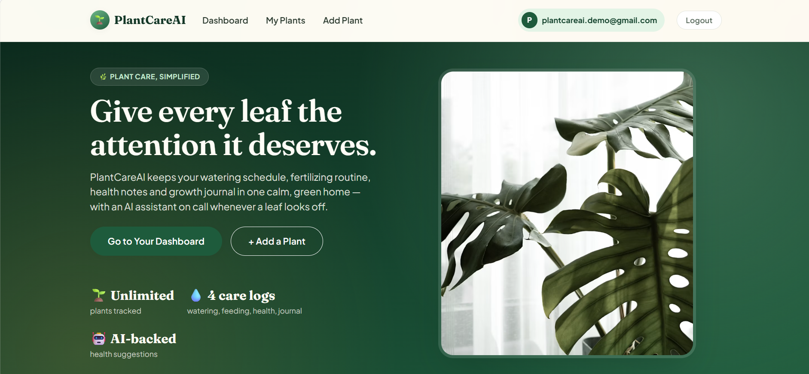
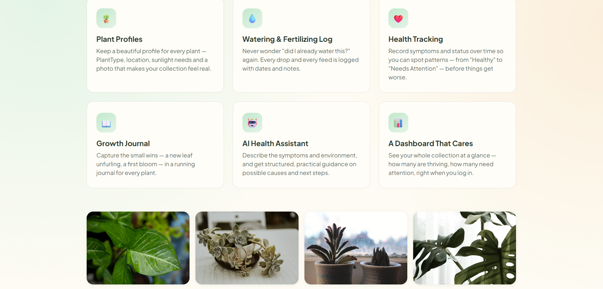
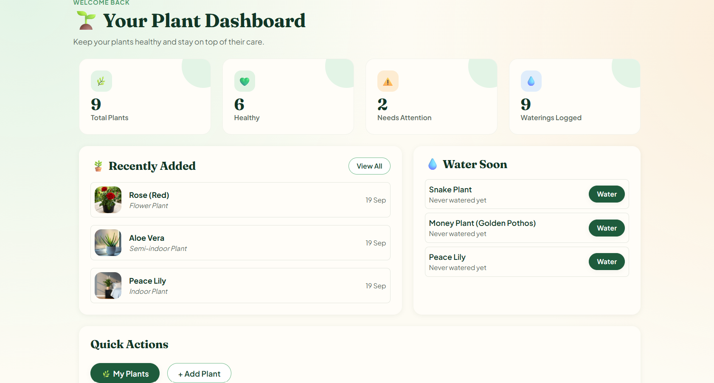
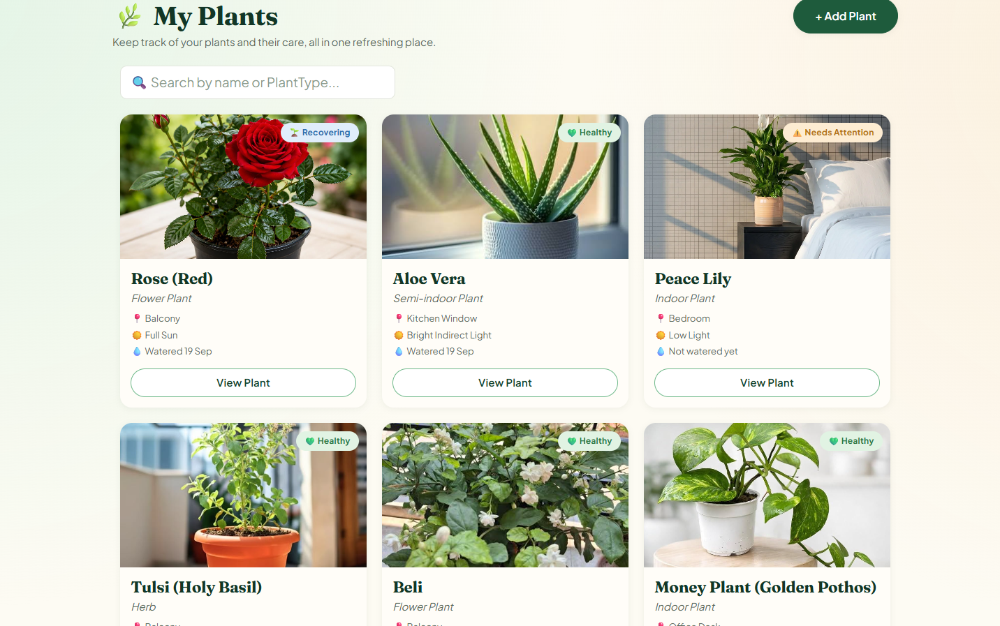
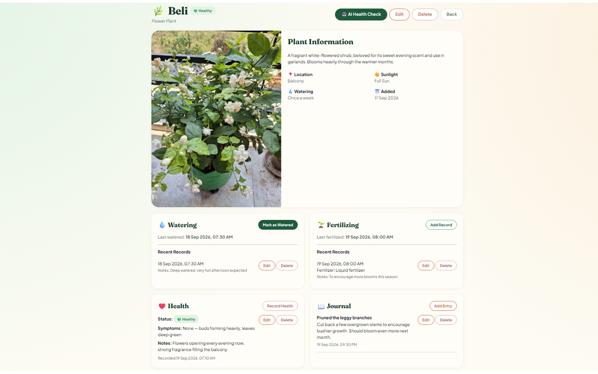
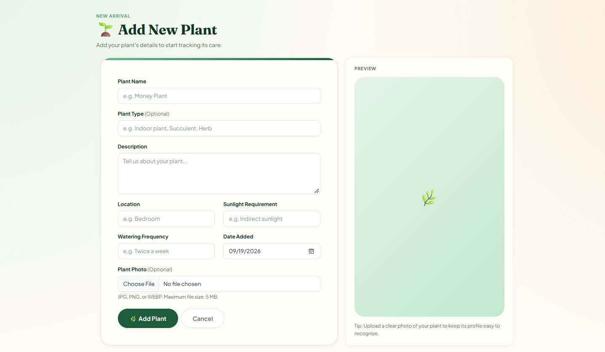
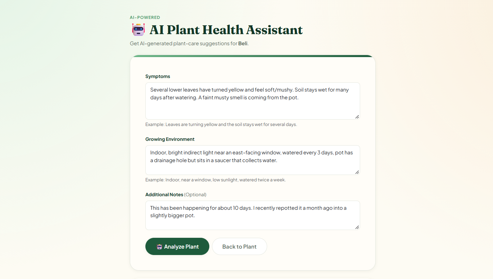
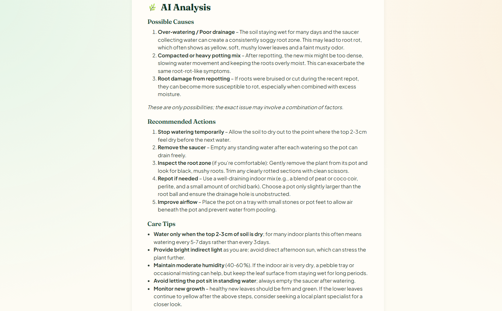

# 🌱 PlantCareAI

**A calm, refreshing home for every plant you love.**

PlantCareAI is a web-based plant care management application that helps users organize their plants, track watering and fertilizing activities, monitor plant health, maintain growth journals, and get AI-powered plant-care guidance.

Built with **ASP.NET Core MVC (.NET 10)**, **Entity Framework Core**, **ASP.NET Core Identity**, **SQL Server**, and the **Groq API**.

---

## 📸 Screenshots

### 🏠 Landing Page

<p align="center">
  
  
</p>

### 📊 Dashboard

<p align="center">
  
</p>

### 🌿 My Plants & Plant Details

<p align="center">
  
  
</p>

### ➕ Add Plant

<p align="center">
  
</p>

### 🤖 AI Plant Health Assistant

<p align="center">
  
  
</p>

---

## ✨ Features

### 🌿 Plant Management

* Create, view, edit, and delete plant profiles
* Store plant name, type, description, location, sunlight requirement, and watering frequency
* Upload a real plant image directly from the device
* Replace or remove uploaded plant images
* Plant data is isolated by authenticated user

### 💧 Care Tracking

* Record watering activities with date and time
* Record fertilizing activities with date and time
* Add notes to care records
* Edit and delete watering and fertilizing records
* View complete care history from the plant details page

### ❤️ Plant Health Tracking

* Record the current health condition of a plant
* Supported health statuses:

  * 💚 Healthy
  * ⚠️ Needs Attention
  * 🌱 Recovering
  * 🚨 Critical
* Store symptoms and additional health notes
* Automatically display the latest health status for each plant

### 📖 Growth Journal

* Create journal entries for individual plants
* Record observations, progress, and notes
* Edit and delete journal entries
* View journal history from the plant details page

### 🤖 AI Plant Health Assistant

* Describe visible plant symptoms
* Provide growing environment information
* Add optional observations or notes
* Receive AI-generated plant-care guidance
* AI responses are structured into useful sections such as possible causes and recommended actions
* Powered by the **Groq API**
* Designed as an informational plant-care assistant, not a professional diagnosis system

### 📊 Dashboard

* View total number of plants
* Track healthy plants
* See plants that need attention
* View watering activity statistics
* See recently added plants
* View plants that may need watering based on their care history
* Quick access to common plant-management actions

### 🔍 Live Plant Search

* Instantly filter plants by name or plant type
* Search directly from the My Plants page without reloading the page

### 🔐 Authentication & Security

* User registration and login through ASP.NET Core Identity
* Authenticated access to plant-management features
* Each user's plants and care records are scoped to their own account
* Anti-forgery protection on POST actions
* Server-side ownership checks prevent unauthorized access to another user's plant data

### 🎨 Custom UI

* Plant-themed visual design
* Warm forest-green and cream color palette
* Responsive layouts using Bootstrap 5
* Custom CSS design system
* Custom in-app delete confirmation modal
* Image preview before uploading a plant photo

---

## 🛠️ Tech Stack

| Layer              | Technology                                      |
| ------------------ | ----------------------------------------------- |
| Framework          | ASP.NET Core MVC (.NET 10)                      |
| Language           | C#                                              |
| ORM                | Entity Framework Core                           |
| Database           | SQL Server / LocalDB                            |
| Authentication     | ASP.NET Core Identity                           |
| AI                 | Groq API                                        |
| HTTP Communication | `HttpClient`                                    |
| Markdown Rendering | Markdig                                         |
| Frontend           | Razor Views, Bootstrap 5, HTML, CSS, JavaScript |
| Version Control    | Git & GitHub                                    |
| Development IDE    | Visual Studio / VS Code                         |

---

## 🏗️ Architecture

PlantCareAI follows the **ASP.NET Core MVC architecture**:

```text
User
 │
 ▼
Razor Views
 │
 ▼
MVC Controllers
 │
 ├── Plant Management
 ├── Care Records
 ├── Dashboard
 └── AI Health Assistant
 │
 ▼
Entity Framework Core
 │
 ▼
SQL Server
```

The AI Health Assistant communicates with the Groq API through a dedicated service layer:

```text
AI Health Check
      │
      ▼
AiPlantService
      │
      ▼
HttpClient
      │
      ▼
Groq API
      │
      ▼
AI-generated plant-care guidance
```

---

## 📁 Project Structure

```text
PlantCareAI/
│
├── Areas/
│   └── Identity/
│       └── Pages/
│           └── Account/
│               └── Manage/
│
├── Controllers/
│   ├── HomeController.cs
│   ├── DashboardController.cs
│   ├── PlantsController.cs
│   ├── CareController.cs
│   └── AIController.cs
│
├── Data/
│   ├── ApplicationDbContext.cs
│   └── Migrations/
│
├── Models/
│   ├── Plant.cs
│   ├── WateringRecord.cs
│   ├── FertilizingRecord.cs
│   ├── HealthRecord.cs
│   └── JournalEntry.cs
│
├── Services/
│   └── AiPlantService.cs
│
├── Views/
│   ├── Home/
│   ├── Dashboard/
│   ├── Plants/
│   └── AI/
│
├── wwwroot/
│   ├── css/
│   │   └── site.css
│   ├── js/
│   │   └── site.js
│   └── uploads/
│       └── plants/
│
├── Program.cs
├── appsettings.json
└── PlantCareAI.csproj
```

---

## 🚀 Getting Started

### Prerequisites

Make sure the following are installed:

* [.NET 10 SDK](https://dotnet.microsoft.com/download)
* SQL Server LocalDB or another SQL Server instance
* Visual Studio or VS Code
* A Groq API key for the AI Health Assistant

### 1. Clone the Repository

```bash
git clone https://github.com/Tasmia-Hossain/PlantCareAI.git
cd PlantCareAI/PlantCareAI
```

### 2. Restore Dependencies

```bash
dotnet restore
```

### 3. Configure the Groq API Key

The application uses **.NET User Secrets** to keep the API key outside the source code.

Initialize user secrets if needed:

```bash
dotnet user-secrets init
```

Then add your Groq API key:

```bash
dotnet user-secrets set "Groq:ApiKey" "your-groq-api-key"
```

> **Never commit your API key to GitHub.**

### 4. Configure the Database

The project uses SQL Server / LocalDB through the connection string in `appsettings.json`.

Update the connection string if you are using a different SQL Server instance.

### 5. Apply EF Core Migrations

```bash
dotnet ef database update
```

### 6. Run the Application

```bash
dotnet run
```

Open the local URL shown in the terminal and register an account to start using PlantCareAI.

---

## 🗃️ Database

PlantCareAI uses **Entity Framework Core Code First** with SQL Server.

The main application entities are:

```text
IdentityUser
     │
     ▼
   Plant
     │
     ├── WateringRecord
     ├── FertilizingRecord
     ├── HealthRecord
     └── JournalEntry
```

Each plant belongs to the authenticated user who created it, and related care records are accessed through their parent plant.

---

## 🖼️ Image Uploads

PlantCareAI supports local plant image uploads.

Uploaded images are stored under:

```text
wwwroot/uploads/plants/
```

The application:

* Supports JPG, JPEG, PNG, and WEBP
* Limits uploads to 5 MB
* Generates a unique server-side filename
* Stores only the image path in the database
* Removes the previous image when a replacement is uploaded
* Removes the uploaded image when the plant is deleted

---

## 🔒 Security

Security is an important part of PlantCareAI's implementation.

### Authentication

ASP.NET Core Identity handles:

* User registration
* Login
* Account management
* Password management

### User Data Isolation

Plant and care-record queries are filtered using the authenticated user's ID.

For example:

```text
Authenticated User
        │
        ▼
      UserId
        │
        ▼
   User's Plants
        │
        ▼
 User's Care Records
```

This prevents one user from accessing another user's plant data by manually changing record IDs in URLs.

### Request Protection

The application also uses:

* `[Authorize]` for protected controllers
* `[ValidateAntiForgeryToken]` for state-changing POST requests
* Server-side validation
* Ownership checks before editing or deleting records
* Server-generated filenames for uploaded images
* API keys stored through User Secrets during development

---

## 🧪 Testing

The application was tested across the main user flows, including:

* User registration and login
* Plant creation, editing, viewing, and deletion
* Plant image upload and replacement
* Watering record creation, editing, and deletion
* Fertilizing record creation, editing, and deletion
* Health record creation, editing, and deletion
* Journal entry creation, editing, and deletion
* Dashboard statistics
* Plant search
* AI Health Check
* User-specific data access
* Delete confirmation flows
* Database migrations and persistence

---

## 📸 Recommended Screenshots

The repository includes screenshots covering the main features of the application:

| Screenshot                   | Purpose                                 |
| ---------------------------- | --------------------------------------- |
| `landing-page-top.png`       | Landing page hero and introduction      |
| `landing-page-bottom.png`    | Lower sections of the landing page      |
| `dashboard.png`              | Plant statistics and dashboard overview |
| `my-plants.png`              | Plant collection with health statuses   |
| `plant-details.png`          | Plant information and care history      |
| `add-plant.png`              | Plant creation form with image upload   |
| `ai-health-check-form.png`   | AI Health Check input form              |
| `ai-health-check-result.png` | AI-generated plant-care analysis        |

Screenshots are stored in:

```text
docs/screenshots/
```

---

## 🔮 Future Improvements

Potential future improvements include:

* 💧 Automated watering reminders
* 🔔 Email or push notifications
* 📸 Multiple images per plant
* 📄 Export plant-care history as PDF
* 📈 More detailed plant-care analytics
* 🌦️ Weather-based watering suggestions
* 🧠 More personalized AI recommendations based on plant history
* 🌱 Plant-specific care schedules

---

## 📚 What This Project Demonstrates

PlantCareAI demonstrates practical experience with:

* C# and ASP.NET Core MVC
* Entity Framework Core
* SQL Server database design
* ASP.NET Core Identity
* Authentication and authorization
* CRUD application development
* MVC architecture
* REST/HTTP API integration
* External AI API integration
* Dependency injection
* User-specific data isolation
* File upload handling
* Server-side validation
* Git/GitHub workflow
* Razor Views and frontend development
* Building a complete full-stack application

---

## 📄 License

This project was developed as a **personal portfolio project** to demonstrate practical software development skills.